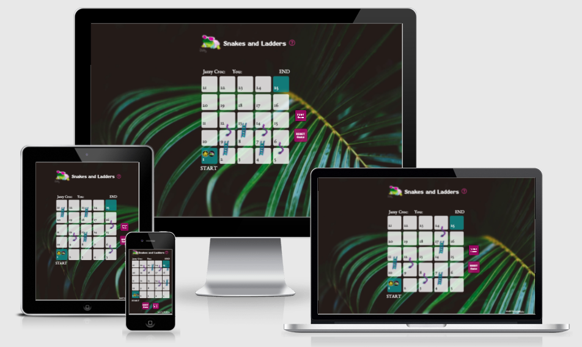
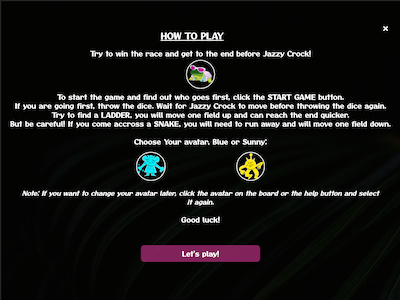
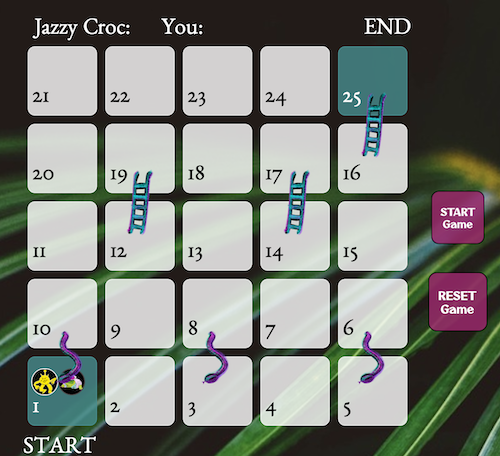
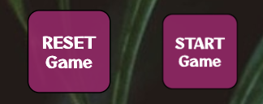
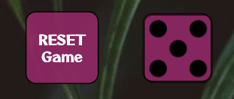
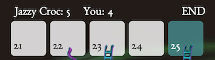

# Snakes and Ladders
Snakes and Ladders brings the popular board game to the screen. The game is aimed at players of all ages and is built purely for entertainment. 

## Deployed at
https://koko-66.github.io/snakes-and-ladders/

## UX
The initial design idea was captured in wireframes available [here](data/Snakes-and-ladders-wireframes.pdf), while the game logic captured in the following an [algorithm](data/snakes-and-ladders_game-flowchart.pdf).

The use of a dark background image with an image of a leaf aims to bring the sense of rainforest and make the game more visually appealing, especially on larger screens. Jazzy Croc is a feature character, and its image is used in the header, as favicon and as an avatar for the Ai (computer player).

### User Stories
1. As a player:
	- I can easily understand the purpose of the game and how to play it. 
	- I can read the instructions again at any time I wish and as needed.
	- I can choose the avatar I want to use and change it at any time during the game. 
	- I can see different types of fields and understand what will happen when I 'step' on them. 
	- I can follow the players' movements on the board and understand how the game progresses.
	- I know whose turn it is and who won the game. 
	- I can reset the game at any point and play the game again.

2. As a returning player: 
	- On returning to/reloading the site I don't want to see the instructions pop up again unless I want to see them. 
	- I want to have an option to select another avatar at any point during the game. 
	- I can play the game on another device and have the same user experience.

## Features and Design
The game consists of an HTML page that features the header, game board, and holds instructions and full-screen messages with information about who is going first and who won the game. 

### Existing Features

#### Instructions

Instructions are the first thing player sees when loading the page. They are placed in a div showing as a full-screen pop-up and contain information about how to play the game, what happens when a player 'stands' on different fields, a choice of two avatars and information on how to change the avatar later during the game. The player cannot move past instructions without choosing an avatar to prevent errors - clicking on "x" (close) icon or the "Let's go" button without selecting one results in a message "Choose avatar" which closing returns the player to the instructions page.
After this first load, instructions are accessible at any time by clicking the "Help" icon .

#### Avatars
The player can choose one of two avatars and change them at any point during the game either by clicking on the help icon or by clicking the avatar directly on the game board. The new avatar then replaces the old one in the same position on the board. 
Avatars move on the board field by field, making it easier for the player to follow the game.

#### Game Board

The board is generated automatically using JavaScript, making it easier to change the number of rows and columns in the future as the game is developed further. The positions for snakes and ladders are also generated by the script and change on reloading the page to make the game more interesting. This also allows for the implementation of different difficulty levels with different numbers of snakes and ladders in the future. 
A new board is generated when the "Reset" button is clicked or after one of the players reaches the end of the board.
 
#### Dice and Start button

The game is controlled with the "Start Game" button and a "Dice". The "Start Game" button pulses to indicate that the player needs to click it and initiates the function checking who will start the game. Once it is clicked, it is replaced by the dice.

Clicking the "Dice" imitates a dice throw, generates a random number between 1 and 6 and the dice's image changes to reflect the throw result. After certain time after Croc's move, the dice starts pulsing as well, indicating that it needs to be clicked to progress with the game.

#### Player's Results

Results for individual players are displayed in a designated place at the top of the board and increase in size temporarily at the time of change to make the turn and movement clearer to the user.

### Features Left to Implement
- Different color scheme(s) and a greater selection of avatars to choose from.
- Rolling effect on the dice.
- Different difficulty levels to choose from (more fields, more snakes and more ladders).

## Technologies Used

### Languages
- HTML
- CSS
- JavaScript

### Frameworks, Libraries and Programs used
- VS Code: used as the primary code editor
- Git: used for version control
- Git Hub: used to store project files
- Google Fonts: used to import fonts used in the project: Nunito and Relay
- Font Awesome: used for the social links icons in the footer
- Affinity Designer: to resize and adjust the images for the website
- Balsamiq: to create wireframes
- yEd: to create an algorithm for the game logic
- Lighthouse (Chrome extension): used to check the performance and accessibility of the website
- Prettier - Code Formatter (VS Code extension): used to beautify the HTML, CSS and JS code
- Dev Tools on Chrome, Firefox and Safari: used for development, code testing and trials

## Testing 

### User Story Testing
1. As a player:
	- I can easily understand the purpose of the game and how to play it. 
		- Instructions for the game load when playing the game for the first time and are available to review at any point during the game. The game title and visuals make a clear connection to a well-known board game and I can draw on my external knowledge to understand how to play.
	- I can read the instructions again at any time I wish and as needed.
		- Instructions are available at the click of the help icon.
	- I can choose the avatar I want to use and change it at any time during the game. 
		- The player can choose from two avatars and can change it at any point by clicking the avatar while on the board or opening the Instructions section. 
	- I can see different types of fields and understand what will happen when I 'step' on them. 
		- The board contains images of snakes and ladders that indicate the direction of movement for the avatars.
	-	I can follow the players' movements on the board and understand how the game progresses. 
		- The avatars are moving one field at a time to simulate the movement of pawns on a real-life board. This helps the player follow what is happening during the game. Both Player's and Croc's (Ai's/computer's) results are displayed on the screen and. The Croc's (Ai's) move happens after the Player has finished avoiding confusion.
	- I know whose turn it is and who won the game.
		- The player's turn is initiated by a throw of dice. When Croc's turn starts, his result increases size temporarily and/or a message pops up with his result. When one of the players reaches the last field a message with information about who won appears. 
	- I can reset the game at any point and play the game again.
		- The game features a "Reset game" button that reloads the page, resetting all values and the game board. It is visible at all times during the game and can be clicked when needed. Once a game is finished, the board and all objects are reset and reloaded. The dice switches back to the "Start Game" button and a new game can be started.

2. As a returning player: 
	- On returning to/reloading the site I don't want to see the instructions pop up again unless I want to see them.
		- Instructions appear automatically only on first loading the page. After that, when the Player loads the page again, the board is loaded. The instructions and avatars are accessible at any time by clicking the "Help" button or the avatar on the board.
  - I want to have an option to select another avatar.
		- Avatar can be swapped at any time in the instructions section without the board being reset.
  - I can play the game on another device and have the same user experience.
		- The game has been designed to appear correctly and maintain the same functionality on devices of different sizes using media queries. The game is not suitable for devices with screens smaller than 280px width.

### Validator Testing 
- HTML
  - No errors were returned when passing through the official [W3C validator](https://validator.w3.org/nu/?doc=https%3A%2F%2Fkoko-66.github.io%2Fsnakes-and-ladders%2F)
- CSS
  - No errors were found when passing through the official [(Jigsaw) validator](https://jigsaw.w3.org/css-validator/validator?uri=https%3A%2F%2Fkoko-66.github.io%2Fsnakes-and-ladders%2F&profile=css3svg&usermedium=all&warning=1&vextwarning=&lang=en)

### Performance Testing
- Run Lighthouse extension to check site performance ([results available here](data/Lighthouse-report.html)).
-  Tested performance and responsiveness on following devices: 
    - Android (Samsung S8, Samsung Note8)
    - iPad Pro 9.7 inch
    - Microsoft Surf 11 inch
    and browsers:
    - Safari
    - Chrome 
    - Firefox
    - Edge
    - Opera

### Bugs and Fixes
During the development and testing of the game, various bugs appeared. A summary of the most important ones can be found below: 

1.  Dice not hiding after viewing and closing Instructions. The use of the showDice() function does not solve the issue as it shows the dice even if the game is not started preventing initiation of the game.

__FIXED__ Removed dice toggle from hide() function when toggling instructions. 

2. Various issues with hiding board and game buttons ("Start Game" button, Dice and "Reset Game" button) when showing full-screen messages and instruction text.

__FIXED__ Removed div for Ai's turn message and showing all messages using the same 'message-box' div (otherwise, if both coinciding, clicking the one on top would unhide the board while still showing the second message) and eventually hiding the 'game-container' div rather than just 'game-board' div to solve issues with Dice and Reset Game being visible.

3. Game could be initiated even if an avatar is not selected, resulting in the avatar showing as "null" instead of an image.

__FIXED__ Added checkForAvatar() function to the "Let's go" button, which displays a "Choose avatar!" message and prevents the Instructions from closing. This way the player cannot start the game until one of the avatars is selected.

4. Changing avatar while the game started causes duplication of avatar and its placement in the first field.

__FIXED__ Adjusted SelectAvatar() function to place the avatar in its current field rather than f1 and in f1 only if no avatar has been previously selected.

5. Reset Board adds another game board below with reverse numbers; objects values not cleared.
	
__FIXED__  Changed the "Reset Game" button to reload the page rather than create new a new one. Before the board is created the innerHtML of the 'game-board' is now first cleared to prevent similar issues when createGameBoard() function is initiated without window reloading. Will prevent issues if any new features are added in the future. 
	
6. When goesFirst() result is a tie, the "Start Game" button is replaced by Dice not allowing the player to try again nor to proceed with the game.

__FIXED__ Deleted showDice() from goesFirst() tie condition, so that if tie "Start Game" button is still showing.

7. 	Players position reaching beyond 25 causing "undefined" error.

__FIXED__ Adjusted function currentPlayerTurn() to change currentPlayer.postion and currentPlayer.newPosition to 25. This way positons are never out of range.
	
8. All movement functions for both players are executing at the same time making it difficult to understand what is happening and whose turn it is.

__FIXED__ Added interval for the currentPlayerTurn() function to move players on the board field by field. Initially added various messages to inform the user about snakes/ladders and ai turns, though these were rather hindering user experience than enhancing it, therefore removed. As a further improvement, added initiateAiMove() function and embedded it in checkType() so that the computer's move gets initiated only once the Player's turn is finished. Tried setTimout() to achieve the same, this method, however, was not precise enough.

9. On first starting the game after loading the page for the first time 'Choose avatar' message showing briefly before that with the information about who is going first.

__FIXED__ Cleared the innerHTML of the message-box as a first step of goesFirst().

10. When clicking the avatar while on the board the instructions show but with game board elements showing underneath. Caused by the event listener attached to the avatar class.

__FIXED__ Changed code to remove event listener from avatars while on the board and added onclick function instead.

11. If a ladder placed in field 16, the checkIfWin() function does not run and gets delayed util the next round.

__FIXED__ Added CheckIfWin() to the the condition checking for ladder in the CheckType() function.

12. Addition of "x" (close) icon to the instructions caused an issue with the board showing even if an avatar is not selected.

__FIXED__ Swapped toggleinstrucions() in the event listener for "close-isntructions" to checkForAvatar(), same as in "Let's go button".

### Unfixed Bugs
- At times, the pulsing of the dice seems to initiate too early, so a further delay might be needed. This needs monitoring and might need further adjustment depending on user feedback. 
- Depending on the placement of snakes and ladders the avatars are sometimes placed slightly off-center. This is not a huge issue from the game functionality point of view, but again, might need further adjustment depending on user feedback.

## Deployment
- The site was deployed to GitHub pages. The steps to deploy are as follows: 
  - In the GitHub repository, navigate to the Settings tab 
	- Select Pages
  - From the source section drop-down menu, select the Master Branch / root (without a theme)
  - Once the master branch has been selected, the page will be automatically refreshed with a detailed ribbon display to indicate the successful deployment. 

The live link can be found here: https://koko-66.github.io/snakes-and-ladders/

## Credits 
A great thank you to: 
- My mentor, Caleb, for extremely valuable pointers on how to visualise the movement on the board, make decisions on the best UX approaches and support throughout the whole project.
- [How to code school](https://www.howtocodeschool.com) and [w3School](https://www.w3schools.com/) for various hints and tips on JavaScript functionalities.
- [BetterProgramming](https://betterprogramming.pub/how-to-build-a-chess-board-with-javascript-480ab182739e?gi=e116ff4de5b6) for instructions on how to use JavaScript to automatically generate the game board. 
- Web Dev Simplified and their [YouTube Tic Tac Toe tutorial](https://www.youtube.com/watch?v=Y-GkMjUZsmM&t=1478s) for the inspiration on alternatives to alerts.
- My son, Phillip, for creating the art for the game.
- Code Speedy for tips on how [dynamically create variables](https://www.codespeedy.com/dynamic-variable-names-in-javascript).
- Sal Ferrarello for the code for "Start Game" and "Dice" [pulsing](https://salferrarello.com/css-pulse-animation/).

### Content 
- Information about the deployment to GitHub mostly taken from a sample Readme file provided by CodeInstitute.
- The icons for the help and close buttons are taken from [Font Awesome](https://fontawesome.com/).

### Media
- Images of the avatars, snake and ladder were created by my son, Phillip.
- Background image is a photo by Pexels, downloaded from Pixelbay.